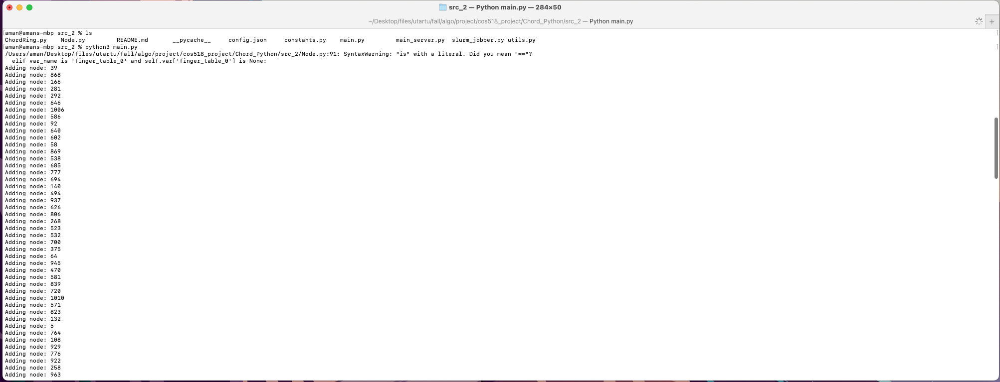

# ChordProtocol
Algorithmics 2022 course project

Team members:
Amangeldy Shalginbayev, Dariya Nagashibayeva

For convenience we highly recommend using PyCharm IDE to run the code. There is Free Community Edition for any platform. You can download and install it here: https://www.jetbrains.com/pycharm/

To run chord protocol simulation, open the project in PyCharm and run main_protocol_simulation/main.py file. Alternatively, you can run via command line python3 main_protocol_simulation/main.py. While simulation runs, you can see simulation results in real time: adding nodes, querying for keys between nodes, etc.  

Running protocol simulation:

<b>Experiment to count number of steps in key query and plot the results:</b> 
Run experiment_count_query_steps/main.py file to run protocol simulation. Then run experiment_count_query_steps/result_dump/collate_csvs.py to collect experiment results and save in csv format. Then run experiment_count_query_steps/plot_count_matrix.ipynb to plot results.  

<b> Experiment to count key distribution between nodes: </b> 
Run experiment_key_distribution_between_nodes/main.py file. This experiment generates 16384 keys in the peer to peer network that needs to be stored among 256 nodes. Distribtuion of keys between nodes saved as text file result in the file experiment_key_distribution_between_nodes/key_distribution_keys_16384_nodes_256_iter_0. Move this file to experiment_key_distribution_between_nodes/result_dump folder. Then run plot_key_histogram_working.ipynb file to plot the graph of 16384 key distribution between 256 nodes in the network.  

We have not written any code to conduct those Chord protocol simulation experiments. Instead we found and studied already implemented solution and run the code to get our own results and plot our own graphs. Also, we configured our own parameters for experiment setup such as number of Nodes in the system, number of keys distributed between nodes, number of iterations in simulations, etc. Reference to the original code: https://bitbucket.org/felixy12/cos518_project/src/master/Chord_Python/src_2/, reference to the article regarding this project from authors: https://medium.com/princeton-systems-course/chord-dht-in-python-b8b8985cb80e.
